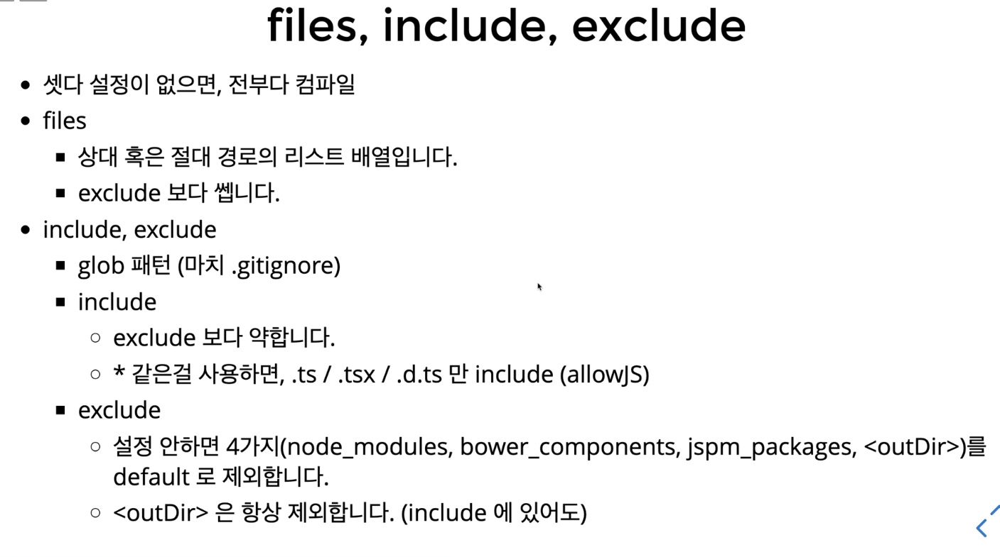

# 3주차 정리

## compliation context
- typescript deep dive에서 확인 가능
- fancy term
- 타입스크립트 컴파일 여부, 옵션 등 맥락
- tsconfig.json 에 정의 됨
- 즉 컴파일러가 어떤 방식으로 동작할지에 대한 맥락이다.

## tsconfig schema
http://json.schemastore.org/tsconfig (스키마 확인 가능)  
버전이 올라갈수록 내용이 많아 지는 중
- definitions 
  - 최상위 프로퍼티들
      - compileOnSave
      - extends
      - compileOptions // 어떤 설정으로 컴파일 할것인지 (내용이 매우 많음)
      - files   // 어떤 파일 컴파일
      - include // 어떤 파일 컴파일
      - exclude // 어떤 파일 컴파일
    
### compileOnSave
- default: false
- 파일을 저장하면 컴파일 하겠다.
- 에디터와 연동해야
- vs-code안에 내장되어 있음

### extends
- 타입스크립트 2.1 이상 사용 가능
- 설정을 다른 파일로 부터 상속한다.
- base.json -> tsconfig.json
```json
// base.json
{
  "compilerOptions": {
    "strict": true
  }
}
```

```json
// ts.config.json
{
  "extends": "./base.json", 
  "compileOnSave": true,
  "compilerOptions": {}
  ...
}
```
깃헙 tsconfig/bases 가면 이미 만들어진 상속 파일들이 있음

### files, include, exclude
- files: files안에 있는 경로들만 컴파일러가 컴파일함
  - type: array
  - include, exclude 보다 우선순
  
- exclude
  - include에 있는 프로퍼티를 제외하는데에는 영향을 줌
  - files에는 영향을 주지 않음
  
- include
  - type: array
  - files나 include에 없으면 모든 파일을 컴파일
  
정리하자면, 


## compileOptions
### typeRoots & types
프로젝트에서 타입이 없는 라이브러리를 사용할때 타입을 지정할 필요가 있는데 그때 사용되는 옵션들이다.  
예를들면 리엑트는 js라이브러리이기 때문에 다음과 같은 에러 발생
```ts
import React from 'react'
//  npm i @types/react 을 설치하라는 에러가 뜬다.
```

- 아무 설정을 안하면 
  - npm i @types/react
  - 설치 경로: node_modules/@types/react/index.d.ts
  - @types/react/index.d.ts를 찾아서 definition으로 사용
  
- typeRoots
  - typeRoots는 디폴트 폴더가 아니라 다른 폴더를 지정할때 사용된다!
  - 배열 안에 들어있는 경로들 아래서만 가져옴
  
- types
  - 패키지 경로가 아닌 이름!
  - 배열안의 모듈 혹은 ./node_modules/@types/안의 모듈 이름에서 찾아옴
  
- typeRoots와 types를 같이 사용하지 않는다.

### target & lib
#### target
프로젝트 설정에 기본이 되고 중요한 설정
- target: 타입스크립트 코드가 어떤 런타임에서 실행할 수 있는지 결정해줌
  - ex) default: ES3
```ts
const hello = () => {};

```
es3 런타임으로 트랜스파일링
```js
'use strict'
var hello = function(){}
```

#### lib
 기본 타입 definition을 어떤 것을 사용할 것이냐
 lib를 지정하지 않을때,
  - target이 es3, 디폴드로 lib.d.ts를 사용
  - target이 es5, 디폴트로 dom, es5, scripthost를 사용
  - target이 es6, 디폴트로 dom, es6, dom.iterable, scripthost
  - lib을 지정하면 그 lib 배열로만 라이브러리를 사용

### outDir, outFile, rootDir
- outDir: 출력 폴더 지정 (dist)
- rootDir: 대상 폴더 지정 (src)
- outFile: 번들링 되는 파일 (특수한 경우에만 사용 가능 require.js)

### strict
작업할때 strict true는 기본이다.
스트릭트 안에는 엄격한 타입체크 옵션이 들어있는데 그것을 다 키는 것
- noimplicitAny
- 