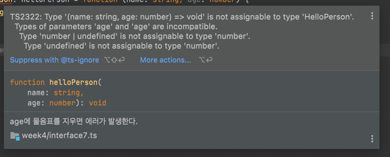

# interface

1. 인터페이스란?   
- 인터페이스는 타입을 만들어 내는 방식   
- 외부적 객체의 사용 방법   

인터페이스는 컴파일 타임에만 필요하다.
```ts
interface Person1 {
    name: string;
    age: number;
}

function hello1(person: Person1): void{
    console.log(`안녕하세요! ${person.name} 입니다.`);
}

const p1: Person1 = {
    name: "mark",
    age: 39,
}

hello1(p1);
```

js로 컴파일 되었을때 인터페이스는 없어진다.
```js
"use strict";
function hello1(person) {
    console.log("\uC548\uB155\uD558\uC138\uC694! " + person.name + " \uC785\uB2C8\uB2E4.");
}
var p1 = {
    name: "mark",
    age: 39,
};
hello1(p1);
```

2. optional property   
?
```ts
interface Person2 {
    name: string;
    age?: number; // 물음표가 붙으면 해당 속성을 꼭 사용하지 않아도 된다.
}

function hello2(person: Person2): void {
    console.log(`안녕하세요! ${person.name} 입니다.`);
}

hello2({name: 'jongyeol', age: 31});
hello2({name: 'jongyeol'});
```

3. 인덱서블 property
```ts
interface Person3 {
    name: string;
    age?: number;
    [index: string]: any // 무엇이든 들어갈 수 있다.
}

function hello3(person: Person3): void {
    console.log(`안녕하세요 ${person.name}입니다.`);
}

const p31: Person3 = {
    name: 'Mark',
    age: 39
};

const p32: Person3 = {
    name: 'Mark',
    systers: ['Sung', 'Chan']
};

const p33: Person3 = {
    name: 'Park',
    father: p31,
    mather: p32
};

```

4. function in interface

```ts
interface Person4 {
    name: string;
    age: number;
    hello(): void;
}


// function 키워드를 활용하여 함수 만들고 hello에 할당하는 방식
const p41: Person4 = {
    name: 'Mark',
    age: 39,
    hello: function (): void {
        console.log(`안녕하세요 ${this.name}`);
    }
};

// function keyword 없이 메서드 선언
// this 를 명시적으로 파라미터로 넘겨주는 방식
const p42: Person4 = {
    name: 'Mark',
    age: 39,
    hello(this: Person4): void {
        console.log(`안녕하세요 ${this.name}`);
    }
};

// 화살표 함수는 에러 발생 
// const p43: Person4 = {
//     name: 'Mark',
//     age: 39,
//     hello: (this: Person4): void => { // 화살표 함수는 렉시컬 this를 바라보기에 사용할 수 없음
//         console.log(`안녕하세요 ${this.name}`);
//     }
// };
```

5. class implements interface
```ts
interface IPerson1 {
    name: string;
    age?: number;
    hello(): void;
}

// 클래스에서 인터페이스를 사용
class Person implements IPerson1 {
    name: string;
    age?: number | undefined;

    constructor(name: string) {
        this.name = name;
    }

    hello(): void {
        console.log(`안녕하세요 ${this.name} 입니다.`)
    }
}

// 인터페이스를 만족해야 하는 인스턴스가 탄생
const person: IPerson1 = new Person('jongyeol');
person.hello();
```
6. interface extends interface
```ts
interface IPerson2 {
    name: string;
    age?: number;
}

interface IKorean extends IPerson2 {
    city: string;
}

const k: IKorean = {
    name: "jongyeol",
    city: "seoul",
}

// 예) HTMLDivElement는 HTMLElement를 상속받고 있음
```

7. function interface
```ts
interface HelloPerson {
    (name: string, age?: number): void;
}

// age에 물음표를 지우면 에러가 발생한다. 
// number | undefined > number 이기 때문에 불가능
const helloPerson: HelloPerson = function (name: string, age: number) {
    console.log(`안녕하세요 ${name} 입니다.`);
};

helloPerson('mark'); // 사용처는 타입만 본다.
```


8. readonly interface  
- 한번 만들어지고 바뀌지 않는 값일때 사용  
- 코드에 의도를 담을 수 있음
```ts
interface Person8 {
    name: string;
    age?: number;
    readonly gender: string;
}

const p81: Person8 = {
    name: 'jongyeol',
    gender: 'male',
}

p81.gender = 'female';
```

9. type alias vs interface
```ts
// 함수
type EatType = (food: string) => void;

interface IEat {
    (food: string): void
}

// 배열
type PersonList = string[];

interface IPersonList {
    [index: number]: string; // string이 아니라 number를 넣으면 배열로 봄
}

// intersection
interface ErrorHandling {
    success: boolean;
}

// 유니온
// 유니온 타입은 인터페이스에서 상속 받을 수 없다.
// 클래스에서도 사용 할 수 없다.

// declaration merging
// 똑같은 이름 인터페이스 선언 될 경우 합쳐짐
// html 엘리먼트를 확장하거나 추가할때 유용
// type alias에서는 불가능

interface MergingInterface {
    a: string;
}
interface MergingInterface {
    b: string
}

let mi: MergingInterface;
// mi.
```